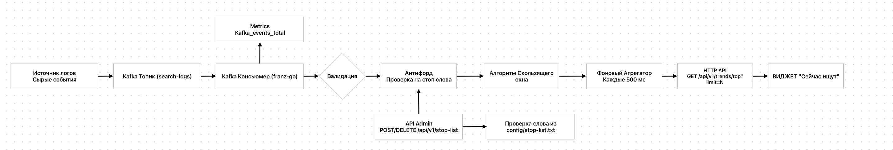

# ADR 0001: Общая архитектура и паттерны обработки данных сервиса Search Trends

## Статус
Принято (Approved)

## Контекст
Разрабатываемый сервис предназначен для формирования виджета «Сейчас ищут» на основе непрерывного потока поисковых запросов Wildberries.
Система должна выдерживать высокие нагрузки (Highload) как на запись (события из брокера), так и на чтение (запросы от пользователей к HTTP API).

Основные требования:
- Расчет метрик в рамках 5-минутного скользящего окна (Sliding Window).
- Исключение использования внешних managed-БД (согласно ТЗ).
- Минимизация времени ответа (Low Latency) и накладных расходов на синхронизацию потоков.

## Решение
Утверждена Event-Driven In-Memory архитектура на базе трехслойной структуры (Clean Architecture): `Transport -> Usecases -> Repository`.

### Ключевые архитектурные паттерны

### 1. Стриминг и защита от всплесков трафика (Backpressure)
Сервис изолирован от прямого HTTP-потока на запись. Фоновый консьюмер асинхронно вытягивает события из брокера через постоянное TCP-соединение. 
Это защищает приложение от OOM в моменты пиковых распродаж (Черная Пятница), так как скорость обработки данных регулируется самим сервисом, а не внешними клиентами.

### 2. Технологический выбор: Apache Kafka
В качестве шины данных выбран распределенный commit log **Apache Kafka**. 
Решение принято на основе сравнительного анализа альтернатив из ТЗ под нагрузку маркетплейса:

*   **Проблема RabbitMQ:** RabbitMQ хорошо подходит для классических задач очередей, RPC и task-dispatching. 
Однако для сценария потоковой аналитики маркетплейса с необходимостью повторного чтения событий (replay), восстановления In-Memory состояния после рестарта и обработки длительных high-throughput stream-нагрузок его модель очередей менее удобна, чем append-only log Kafka. В enterprise-нагрузках подобного типа Kafka обычно обеспечивает более предсказуемую производительность и проще масштабируется горизонтально.
*   **Проблема NATS Core:**  NATS Core ориентирован на ultra-low-latency messaging и lightweight pub/sub взаимодействие.
Для задач аналитического стриминга с необходимостью durable replay, длительного retention и восстановления состояния после сбоев потребовалось бы использование JetStream и дополнительное усложнение архитектуры.
В данном сценарии Kafka предоставляет более зрелую экосистему для event streaming workloads.
*   **Преимущество Kafka:** Последовательная запись на диск (Sequential I/O) обеспечивает скорость на уровне памяти. 
Данные не удаляются после чтения, что позволяет сервису при холодном старте сместить offset на 5 минут назад, перечитать лог и полностью восстановить аналитический стейт в RAM.

В качестве клиента был выбран franz-kafka. Ключевым фактором выбора стало отсутствие зависимости от CGO, в отличие от confluent-kafka-go, который является Go-оберткой над нативной библиотекой librdkafka.
Использование pure Go implementation дает ряд инфраструктурных преимуществ: простота сборки, отсутствие зависимостей от системных C-библиотек, простота контейнеризации, размер образа.
Так же franz-kafka хорошо оптимизирована под высокие нагрузки и потребляет меньше памяти, так как спроектирована под минимизацию аллокаций.

> **Абстракция брокера (Loose Coupling):** Интеграция с Kafka полностью скрыта за Go-интерфейсами на уровне домена. Логика расчета трендов оперирует абстрактным консьюмером. Это исключает жесткую привязку к вендору и позволяет заменить брокер стриминга без изменения ядра системы.

### 3. Дискретизация скользящего окна (Discretized Sliding Window)

Для эффективного расчета Top-N запросов используется ring buffer из 300 секундных бакетов, покрывающих последние 5 минут.
Каждый входящий поисковый запрос агрегируется в бакет текущей секунды. Раз в секунду окно сдвигается: самый старый бакет очищается и переиспользуется для нового временного интервала.

Подобная схема позволяет:
- избежать хранения каждого отдельного события;
- обеспечить фиксированное потребление памяти;
- минимизировать количество аллокаций и нагрузку на GC;
- поддерживать достаточно высокую временную точность для realtime-виджета.

### 4. Оптимизация чтения
Для исключения взаимных блокировок (Resource Contention) между консьюмером брокера и HTTP-воркерами применено разделение потоков:
*   Тяжелая агрегация бакетов и сортировка Топ-N вынесены в изолированный фоновый поток, работающий по тикеру раз в 500 мс.
*   Результат сортировки атомарно сохраняется в переменную состояния приложения с помощью указателя через `atomic.Value` или легковесный `sync.RWMutex`.
*   Клиентские HTTP-запросы `GET /api/v1/trends/top` не выполняют расчеты, а мгновенно считывают готовый срез памяти за константное время $O(1)$.

## Последствия (Trade-offs)

### Плюсы:
*   Экстремальная пропускная способность на чтение и запись (сотни тысяч RPS).
*   Предсказуемое, фиксированное потребление RAM без риска утечек.
*   Нулевой сетевой оверхед (отсутствуют хопы до внешних баз данных).

### Минусы:
*   Данные хранятся в оперативной памяти. При падении процесса статистика за последние 5 минут сбрасывается, но этот риск полностью компенсирован возможностью безопасной повторной вычитки хвоста логов (Offset Replay) из Apache Kafka. Для продуктового аналитического виджета данный компромисс является оптимальным.
*   Использование карты для бакетов, хоть и эффективно по скоросте, однако приводит к росту памяти при высокой уникальности запросов,
что будет нагружать GC, из чего следует, что модель плохо масштабируется при неограниченной уникальности ключей.
Для решения данной проблемы можно рассмотреть нормализацию входных данных, чтобы убрать мусорные ключи,
и семантическую нормализацию ключей, по id или категории например: `map[product_id]int64`
Так же можно рассмотреть использования алгоритмов машинного обучения, но тогда будет высокая нагрузка на gpu.